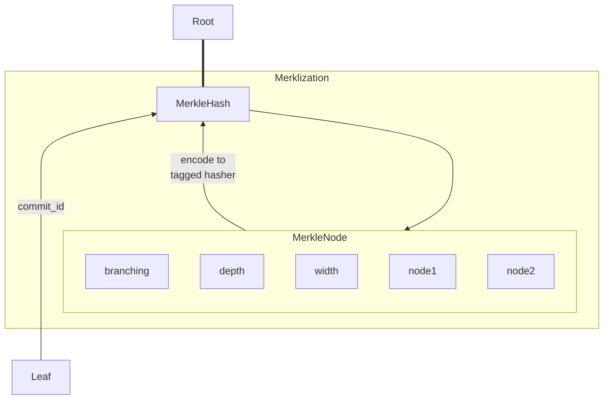
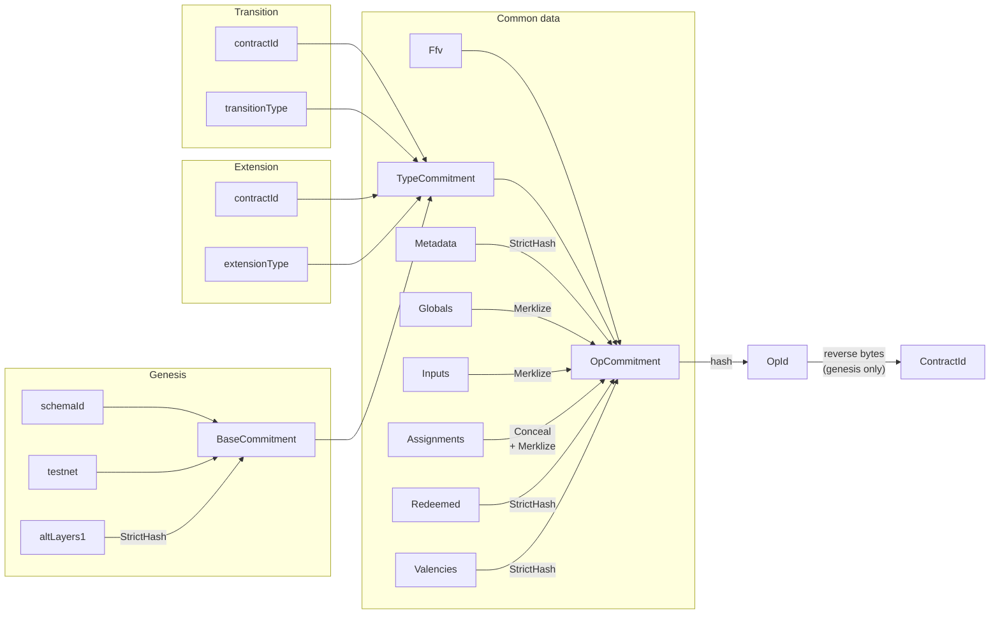
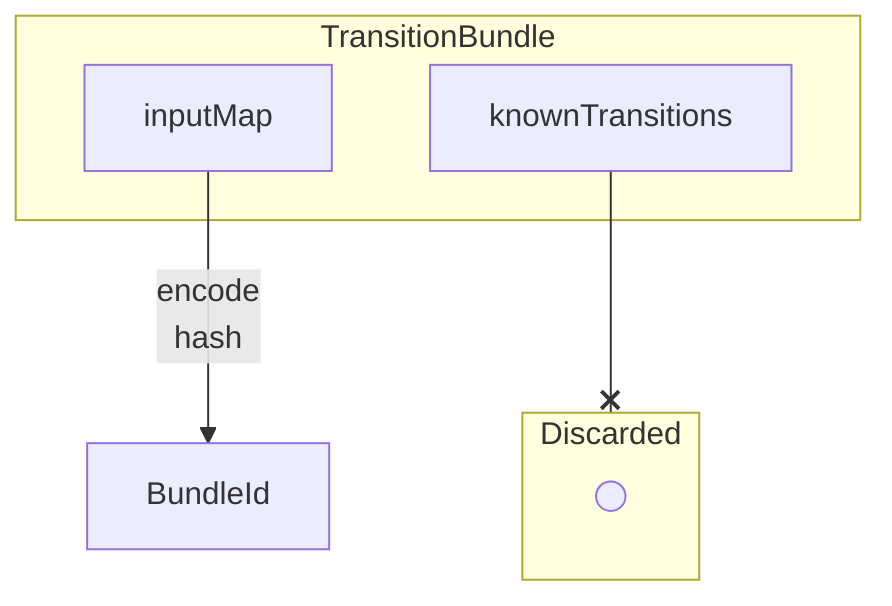

# RGB consensus commitments

RGB commits to client-side validated data using dedicated serialization
mechanism, implemented via `CommitEncode` trait. Depending on the specific data,
the mechanism can be is partially or completely different from strict
serialization, used for data storage. For instance, all data which may be
confidential must be concealed, such that parties having no access to the
original non-confidential values still be able to generate the same
deterministic commitment value and verify single-use seals.

Any final consensus commitment is a SHA256 tagged hash. The tagging is performed
according to BIP-340, when a commitment-specific fixed ASCII string value is
first hashed with a single SHA256 hash, and the resulting 32 bytes are feed into
a new SHA256 hasher twice before any actual data.

## Generating commitment id

The commitment mechanism uses traits from [`commit_verify`] crate, specifically
its `id.rs`and `merkle.rs` modules.

### `CommitEncode` trait

It is the main trait which must be implemented for each type requiring a
dedicated commitment id.

The trait implementation can be done either with derive macro
`#[derive(CommitEncode)]` or by providing a manual implementation.

The derive macro takes two arguments: `strategy` and `id`:

- `id` must specify a resulting commitment id type, i.e. type wrapping 32-byte
  tagged SHA256 hash, implementing `CommitmentId` trait (the implementation
  provides a tag for the hasher - see trait details below). The type must also
  provide a converting constructor from `coommit_verify::Sha256` hasher.
- `strategy` specifies a workflow used to feed the type data to the SHA256
  tagged hasher:
    * `strategy = strict`: the hasher receive strict-serialized type;
    * `strategy = conceal`: the type data are first concealed, and only then are
      strict-serialized into the hasher.

Manual `CommitEncode` implementation must be provided only when the commitment
procedure is custom and can't be implemented using any of the strategies, for
instance when a collection must be merklized (see on merklization below).

NB: you should never call methods of `CommitEncode` trait directly, and instead
use `CommitId` trait, which is automatically implemented for

### `CommitmentId` trait

Each consensus commitment must have a dedicated Rust newtype, which wraps over
inner `Bytes32` - a 32-byte resulting tagged hash value. The type is marked as
a consensus commitment by implementing `CommitmentId` trait for it, which
requires to provide a tag string values for the tagged hash.

The hash tags are defined using URN strings in form of
`urn:<org>:<protocol>:<data>#<date>`, where `<org>` stands for the organization,
`<protocol>` is the name of the protocol, `<data>` is the data type name
producing the commitment, and `<date>` is a `YYYY-MM-DD` string for the latest
revision of the commitment layout.

### `CommitId` trait

This trait is automatically implemented for all types which have `CommitEncode`
implementation. You can't implement this trait manually and just need to call
its `CommitId::commit_id()` method to produce the final commitment (i.e. bytes
of the tagged hash in form of `CommitmentId`-implementing type).

The trait also provides `CommitId::commitment_layout()` method, which can be
used for automatically generating the documentation on the commitment workflow.

## Merklization procedure

Merlization procedure uses traits and data types from `merkle.rs` module of
`commit_verify` crate. It commits to the tree parameters, such as number of
elements, depth of the tree, as well as depth of each node; and uses tagged
SHA256, like the rest of the commitment procedures used here.

The main data type, related to the merklization, is `MerkleHash`: it is a tagged
hash (using `urn:ubideco:merkle:node#2024-01-31` tag) representing node at any
position of the tree: leaves, branch nodes and merkle tree root. `MerkleHash`
can be produced in the following ways:

- as a result of merklziation procedure, when it represents Merkle tree root;
- as a root of empty Merkle tree (i.e. collection having 0 elements), by calling
  `MerkleHash::void(0u8, 0u32)`,
- as a Merkle leaf, by implementing `CommitEncode` on some type and setting
  commitment id to be `MerkleHash`.

In all of the above cases the hash commits to the tree parameters, which makes
it safe to use the same type for leaves, branches and root nodes. Specifically,
it uses an intermediate structure `MerkleNode`, which is filled with information
on (see [`MerkleNode.vesper`](../stl/MerkleNode.vesper) for details):

- type of node branching (no branches, one branch or two branches),
- depth of the node, as 8-bit unsigned integer,
- width of the tree at its base, as a 256-bit LE unsigned integer,
- node hashes of the branches; if one or both branches are absent, they are
  replaced with 32 bytes of repeated 0xFF value.

A collection in form of a list (Rust `Vec`) or an ordered set of unique
non-repeating items (Rust `BTreeSet`), if wrapped into a confinement (i.e. has
type-defined bounds on the minimum or maximum number of items) can be
automatically merklized when passed as an argument to `MerkleHash::merklize()`
call. The API puts the following requirements on the collection: either

- maximum number of elements must be either 0xFF or 0xFFFF **and** each
  collection element must implement `CommitEncode` trait with target id set to
  `MerkleHash`,
- or there is a manual implementation of `MerkleLeaves` trait.

## Specific RGB consensus commitments

Currently, RGB has three consensus commitments: schema, operation and bundle.
Operation commitment for genesis has a second representation, named contract id,
which uses reversed-byte encoding and a special string serialization, but is
generated with the same procedure as the operation commitment.

The commitment ids can be generated with either type-specific methods
(`schema_id()` for schema, `bundle_id()` for state transition bundle and
`id()` for any operation) or `CommitId::commit_id()` method, which must provide
the equal result.

Here are more details on each type of the commitments:

| Commitment ID        | Produced by                          | Procedure                                                                                      | Tag URN suffix(1)             |
|----------------------|--------------------------------------|------------------------------------------------------------------------------------------------|-------------------------------|
| `SchemaID`           | `RootSchema`, `SubSchema`            | strict serialization                                                                           | `rgb:schema#2024-02-03`       |
| `OpId`, `ContractId` | `Genesis`, `Transition`, `Extension` | nested commitments with concealing, merklization etc via intermediate `OpCommitment` structure | `rgb:operation#2024-02-03`    |
| `BundleId`           | `TransitionBundle`                   | conceal and partial strict serialization                                                       | `rgb:bundle#2024-02-03`       |
| `SecretSeal`         | `BlindSeal`                          | strict serialization                                                                           | `seals:secret#2024-02-03`     |
| `ConcealedData`      | `RevealedData`                       | strict serialization                                                                           | `rgb:state-data#2024-02-12`   |
| `ConcealedAttach`    | `RevealedAttach`                     | strict serialization                                                                           | `rgb:state-attach#2024-02-12` |

(1): "URN suffix" is a part which follows "urn:lnp-bp:" prefix.

The last three commitments coincide to be a concealed form of BP seals and RGB
state.
These commitments produced by either calling `commit_id` or `conceal` methods of
revealed seal (`BlindSeal`) and state types (`RevealedData`
and `RevealedAttach`).

Additionally to these types there are two other commitment ids used internally
by merklization and strict encoding procedures: `MerkleHash` (discussed in the
Merklization section above) and `StrictHash` from `commit_verify` crate:

| Commitment ID     | Tag URN suffix                                   |
|-------------------|--------------------------------------------------|
| `MerkleHash`      | `urn:ubideco:merkle:node#2024-01-31`             |
| `StrictHash`      | `urn:ubideco:strict-types:value-hash#2024-02-10` |
| `mpc::Commitment` | `urn:ubideco:mpc:commitment#2024-01-31`          |

`StrictHash` can be produced as a result of serialization of any
strict-encodable data; for instance, it is used in compactifying collections
into a single hash field in the process of computing operation ids (described
below).

Finally, in `commit_verify::mpc`, multi-protocol commitment protocol
implementation, we have a type named `mpc::Commitment`, which is a commitment
to a root of the MPC tree (i.e. the tree's root `MerkleHash` is tag-hashed once
again to produce the final commitment value).

### Schema ID

Schema id, represented by `SchemaId` data type, is produced from `Schema` type
via strict serialization of all the schema data using
`urn:lnp-bp:rgb:schema#2024-02-03` hash tag. No conceal or merklization
procedures are applied; i.e. the commitment id is the same as hashing serialized
schema with the given tag. The full description of how schema data are
serialized into the hasher can be found in [`Schema.vesper`](
../stl/Genesis.vesper) file, which is automatically generated from the RGB rust
code.

### Operation ID and Contract ID

Operation id is represented by a `OpId` type and produced for `Genesis`,
`Transition` and `Extension` types via custom algorithm, which first creates a
dedicated `OpCommitment` structure, and strict-serializes it to hasher,
initialized with `urn:lnp-bp:rgb:operation#2024-02-03` hash tag.

The `OpCommitment` by itself consists of a sub-commitments to blocks of the
operation data, where each sub-commitment is created with a custom procedure.
For instance, operation global state, inputs and assignments are merklized,
such that a succinct proofs of some specific state or input inclusion in RGB
operation can be produced and used in smart contracts. Additionally to that,
assignments are concealed before the merklization, and range proofs are
removed from the commitment, such that an aggregation of the historical proofs
can be applied without changing the operation ids.

To ensure succinctness, other types of collections, such as redeemed and
defined valencies and list of alternate layer 1 in genesis are not merklized
and strict-serialized producing `StrictHash`, which participates in the final
`OpCommitment` structure.

Additionally to `OpId`, genesis produces `ContractId`, which is made out of the
genesis `OpId` by reversing byte order and using Base58 encoding.

### Bundle ID

Bundle id is a unique identifier of state transition bundle, directly used in
constructing multi-protocol commitment tree. Bundle id commits to operation ids
for the participating state transitions and maps of the witness transaction
input to the operation ids. For this purpose, the commitment is created by
strict-encoding `input_map` field of `TransitionBundle` into the hasher,
initialized with tag `urn:lnp-bp:rgb:bundle#2024-02-03`. Input map is serialized
first as a 16-bit little-endian integer specifying the number of the items in
the map, followed by the sequence of pairs of input number (32-bit LE value)
and `OpId` (32-bytes).

[`commit_verify`]: https://docs.rs/commit_verify
